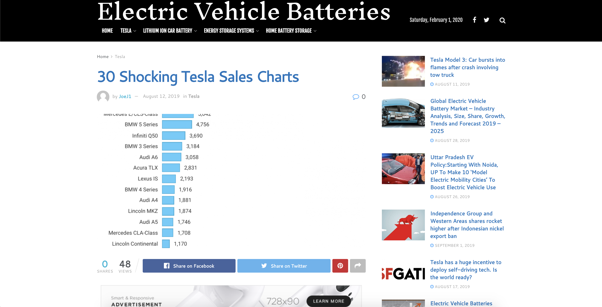

# Assignment 3&4

## 1.The Data

### 1.1 Find the Data

The data I chose is “The US Small + Midsize Luxury Cars Sales in December 2018”, which is posted on the “electrcvehiclebatteries.pro”. The visualization is focusing on the month of December 2018 and trying to emphasis the lead role of Tesla Model 3 in the US market.

https://electricvehiclebatteries.pro/2019/08/12/30-shocking-tesla-sales-charts/

### 1.2 Critique the Visualization

This chart mainly emphasize the exceedingly high sales performance of Tesla Model 3 and the audience can easily and intuitively catch the idea of the chart maker. However, audience can not go deeply into the data of the chart to analyze the competitors performance in a more intuitive way, such as Mercedes and BMW have several models selected into the chart but the audience can't easily detect how they are performing as a whole. 

Below are the analysis based on Stephen Few’s Data Visualization Effectiveness Profile.

Usefulness - 10, The data mainly targets potential customers of buying a new car. The visualization covered enough amount of items and present them in descending order. Moreover, it illustrates the exact number of each car model for the reference of the audience by descending order to have a clear ranking of the sales performance.

Completeness - 6, All of the context that is needed to understand the sales performance has not been provided. It shows “The US Small + Midsize Luxury Cars Sales in December 2018”, but this site only provided the information of December. 

Perceptibility - 4, Only the leading car model is highlighted. It is not intuitive to dig deep into the data that is provided as the rest of the car models are not well categorized and the audience should manually check and find the model that is provided by the same brand.

Truthfulness - 10, The exact numbers are provided and the bar length is created by the same proportion of the numbers of each car models.

Intuitiveness - 7, It is organized in descending order for audience to easily catch the ranking and the leading model is highlighted. However, the audience can not go deeply into the data of the chart to analyze the competitors performance.

Aesthetics - 4,  The color of the chart and the style of the column is not appealing to the audience. The color combination can be improved and the stroke of the column is redundant. And also, the bar of month choice is even bigger than the title for the visualization.

Engagement - 8, The visualization has the high potential encourage the audience to discuss further about the topics it provided. If the sales comparison by brands can be more helpful.

### 1.3 What Can Be Improved

I will find a better way to categorize the competitive brand by different colors for audience to have a more valuable analysis other than only knowing about the relative position of Tesla Model 3 which ranks No.1.  And also, I will generate another bar chart that can show the overall sales performance by brands, such as accumulate Mercedes C-Class, E/CLS-Class, and CLA-Class as one “Mercedes” category. I will adjust the color of the chart and the style of the column to have a better aesthetics. Furthermore, I will downsize the bar of month choice that is bigger than the title for the visualization.

## 2. Ideation

### 2.1 Wireframe a Solution

First of all, categorize the competitive brand by different colors for audience to have a more valuable analysis other than only knowing about the relative position of Tesla Model 3 which ranks No.1. Then another bar chart is generated to show the overall sales performance by brands, such as accumulate Mercedes C-Class, E/CLS-Class, and CLA-Class as one “Mercedes” category.

### 2.2 The Redesigned Visualization

## 3. Testing and Feedbacks

I found one of my neighbors and one of my classmates to test my redesigned visualization. 

It is easy to understand the sales performance by different car brands. But they can not intuitively tell what the visualization is talking about, so the subtitle for the two bar graph would be helpful. And iOne of them thinks the intended audience is for business analysis company and another one considers it is for the person who is planning to buy a new car.

The things that they think can be improved is that column of the left chart can be enlarged to make some difference with the left column to differentiate from the right one which contains more detailed items. And also, one of them suggested that brand logo is helpful for the visualization to be more intuitive.

## 4.Final Design

I enlarged the left bar graph according to the feedback and I decided to add brand logos on the left bar graph with a low-fidelity logo, because high-fidelity logo can distract the overall visualization by adding too much details in the graph.And also add subtitle for the separate two bar graphs.

Data source:https://electricvehiclebatteries.pro/2019/08/12/30-shocking-tesla-sales-charts/

