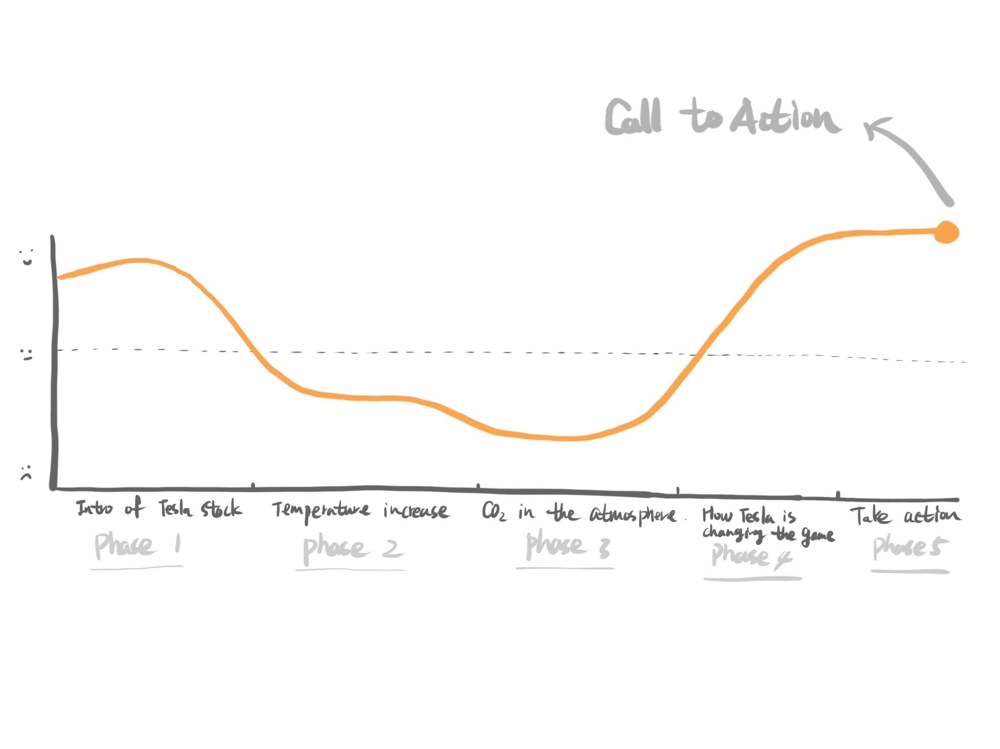
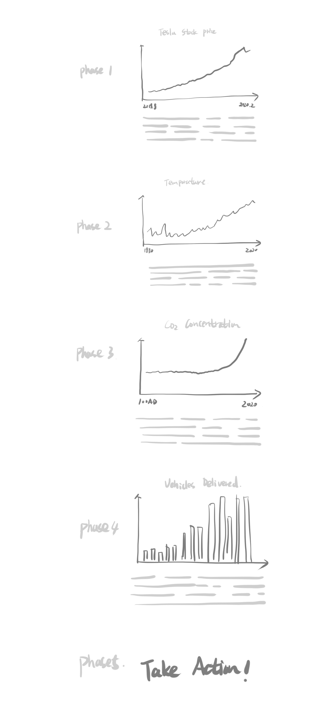

# Final Project

## Part 1

## Outline

### Summary

At its peak value of $174.7 billion on Tuesday, 4th February, Tesla was the 30th-largest stock in the U.S. and by far the largest never to have made a full-year profit. 

For the final project I want to advocate people to buy electric car to stop destroying our environment.

### Story Arc

1.Intro to the Tesla stock performance

Starting with recently hot Tesla stock performance to attract the audience.

2.Temperature increase

Global average temperature has increased by more than one degree celsius since pre-industrial times. We see that over the last few decades, global temperatures have risen sharply — to approximately 0.7℃ higher than our 1961-1990 baseline. When extended back to 1850, we see that temperatures then were a further 0.4℃ colder than they were in our baseline. Overall, this would amount to an average temperature rise of 1.1℃.

3. CO2 in the atmosphere

CO2 concentrations in the atmosphere are at their highest levels in over 800,000 years.
This rise in global average temperature is attributed to an increase in greenhouse gas emissions.This link between global temperatures and greenhouse gas concentrations – especially CO2 – has been true throughout Earth’s history. In the chart here we see global average concentrations of CO2 in the atmosphere over the past 800,000 years.

4. How Tesla is changing the game

I’m going to highlight how Tesla changed the game in the automobile market and how it went through all the challenges with the support of its historical data and several major events occurred in its cruise to the throne of electric car market. And I will try to explain what it means to the automobile market and the life of every single person on our earth.

5. Call to action

According to all the stories with data provided above, the potential car buyers will make a better decision to make contribution to our earth.

### Initial Sketches

### Data

The Tesla stock price data is from the "Yahoo Finance”, which is the primary source of stock prices and the performance of the public company. The average temperature data and atmospheric CO2 concentration data are from “our world in data” which is set to present research and data to make progress against the world’s largest problems. The statistics of about the Tesla are gathered in a financial data platform - Hyperchart.

Using this data, I’m going to create visualizations to advocate people to buy electric car to stop destroying our environment. 

Data source links: 

https://hypercharts.co/tsla?r=google-ads&gclid=CjwKCAiA1fnxBRBBEiwAVUouUqLgorjQ94R9Z-GXcgYghcUOr2A9VUconfK_Vkq6FyZo76uYsDb2rhoCJdoQAvD_BwE

https://ourworldindata.org/co2-and-other-greenhouse-gas-emissions

https://finance.yahoo.com/chart/TSLA

### Method & Medium

For my final project, I plan on building my story using Shorthand, which is the premier platform for creating immersive digital stories for the web. I will first get familiar with the platform and explore some of the templates.

Starting with analyzing the data from “Yahoo finance”, “Our world in data” and “Hyper Chart”, I will synthesize the core insights from it and re create the visualization to support the final action call - “advocate people to buy electric car to stop destroying our environment.”

Then I will conduct research on energy industry and show how other automobile companies are answering to the trends which created by Tesla
