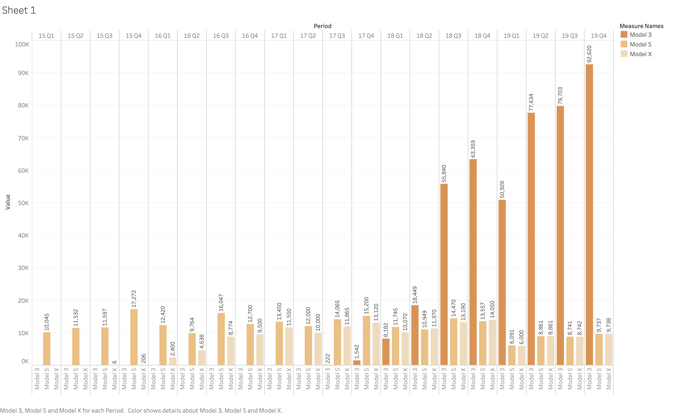

# Final Project

# Part 2

## 1.Project Outline (iterated based on part 1)

At its peak value of $174.7 billion on Tuesday, 4th February, Tesla was the 30th-largest stock in the U.S. and by far the largest never to have made a full-year profit. Starting introducing the recent big news about Tesla, the leap of its stock, the behind drive and trend will be discussed such as the cars are becoming more affordable, the sufficient distribution of the supercharger stations and the increasing awareness of the clean energy usage. And finally advocate people to purchase electric cars to stop destroying the earth and support the surge of electric car industry. 


## 2.Wireframes and storyboard
```
1.Here I outlined how I would tell the story for the final presentation. 
2.The big news around Tesla that the stock price surged 36% in two days.
3.The stock price trends over last one year.
4.Try to figure out the behind drives and reasons.
5.Reason1: The sales performance was beyond expectation.
6.Reason2: Tesla is leading the market of small&midsize luxury car.
7.Reason3: The unit price is constantly dropping.
8.Reason4: The number of super charger is increasing steadily.
9.Reason5: Tesla is eco-friendly.
10.Advocate save our earth by supporting the electric car industry.
```
Below is the initial sketches & refined sketches


## 3.User Research

The above improvement was made based on the user research.

### 3.1Target Audience and Participants

The target audience were the people that drives traditional gasoline-powered cars and the ones that are considering buying a new car.

### 3.2 Interview Protocol

I didn’t introduced the project at first and leave the interviewee to go through all the wireframes by themselves and asked what part is confusing and why. After I explain what I plan to deliver, I started asking below questions.
```
1. All the charts are clear enough to understand?
2. Is it intuitive and easy to understand?
3. What you would like to change if you have the right to make changes?
4. Do you think the overall story is worth being told?
```
### 3.3 Findings & Insights

The description should be concise and key words should be highlighted.
Some charts need to be more elaborate
The transition between performance factor of Tesla and sustainability part is too abrupt.
The last part should add some facts that sustainability is adding values to the products and customers are willing to care about whether they are buying eco-friendly products.

## 4. High-fidelity Data Visualizations





## 5. Data Resources Links
```
https://finance.yahoo.com/quote/TSLA/
https://hypercharts.co/tsla?r=google-ads&gclid=CjwKCAiA1fnxBRBBEiwAVUouUqLgorjQ94R9Z-GXcgYghcUOr2A9VUconfK_Vkq6FyZo76uYsDb2rhoCJdoQAvD_BwE
https://www.cargurus.com/Cars/price-trends/Tesla-m112
https://ourworldindata.org/co2-and-other-greenhouse-gas-emissions
```

